# Cyclone DDS 1 kHz 通信测试报告

- 测试日期：2026-07-03，追加测试：2026-07-06
- Cyclone DDS：0.10.5
- 消息频率：1 kHz 基准；2 kHz、5 kHz 频率压力；1 kHz CPU 压力
- 消息大小：约 128 B 基准；32～64 KiB 负载测试
- 网络传输：UDP
- DDS Domain：0
- 实时配置候选：CPU `1,2`、`SCHED_FIFO 40`

## 1. 测试目标

本次测试分为两条互补的验证路径：

1. 使用 `ddsperf ping/pong` 测量往返通信能力。ddsperf 报告的是
   `RTT / 2`，适合比较绑核和实时优先级对通信时延的影响。
2. 使用 C++ `arm_state_1khz` Demo 模拟机械臂状态流。Publisher 每
   1 ms 发布一次，Subscriber 检查应用可见接收周期、抖动和序号连续性。

两组数据的口径不同，不能把 ddsperf 的 `RTT / 2` 与 C++ 的相邻接收
间隔直接当作同一种“网络延迟”比较。C++ Demo 未使用 PTP 统一两台机器
的时钟，因此没有计算跨主机单向传输时延。

## 2. 测试环境

发送端已确认使用 PREEMPT_RT 内核：

```text
Linux 5.15.148-rt74 PREEMPT_RT
4 个物理核 / 8 个逻辑 CPU
CPU 0,4 -> core 0
CPU 1,5 -> core 1
CPU 2,6 -> core 2
CPU 3,7 -> core 3
```

网卡 `enp0s31f6` 的 IRQ 主要位于 CPU 7。因此选择 CPU `1,2`，既避开
网卡 IRQ，又使用两个不同的物理核。内核实时调度限额为：

```text
sched_rt_period_us  = 1000000
sched_rt_runtime_us = 950000
```

## 3. ddsperf 测试过程

### 3.1 原始基准

最初使用普通调度、不绑核的方式运行：

```text
ddsperf ping 1kHz size 128 listener
```

原计划运行 28800 秒，但 SSH 会话退出后进程收到 `SIGHUP`，实际运行
5211 秒。因此后续统一使用 5211 秒作为长时间测试基准，并改用
`sudo setsid -f ...` 脱离终端。

### 3.2 单逻辑核 + FIFO 40

Ping 和 Pong 都限制在 CPU 2，并使用 `SCHED_FIFO 40`。典型时延和
超时率改善，但 ddsperf 的工作线程和每秒统计输出共用一个逻辑核，
几乎每秒都出现一次约 1.25～1.5 ms 的峰值，最坏值反而变差。

### 3.3 双物理核 + FIFO 40

将进程允许在 CPU `1,2` 上运行，优先级保持 `SCHED_FIFO 40`，先进行
600 秒筛选。结果明显优于前两种配置，因此被选为后续推荐配置。

### 3.4 ddsperf 结果

| 配置 | 时长 | 收到 RTT 样本 | Ping 超时 | 超时率 | 平均 RTT/2 | P50* | P90* | P99* | 最大值 |
|---|---:|---:|---:|---:|---:|---:|---:|---:|---:|
| 默认调度、不绑核 | 5211 s | 5,196,733 | 3,240 | 0.062308% | 234.628 µs | 241.337 µs | 267.534 µs | 281.211 µs | 756.292 µs |
| CPU 2 + FIFO 40 | 5211 s | 5,200,987 | 984 | 0.018916% | 235.021 µs | 243.610 µs | 265.088 µs | 277.032 µs | 1776.803 µs |
| CPU 1,2 + FIFO 40 | 600 s | 598,817 | 3 | 0.000501% | 207.195 µs | 212.242 µs | 236.485 µs | 247.832 µs | 319.051 µs |

\* ddsperf 日志只保留每个一秒窗口的分位值，因此表中的 P50/P90/P99 是
各窗口分位值的算术平均，不是对全部原始 RTT 样本重新排序。

RTT/2 的每秒窗口 P99 平均值：

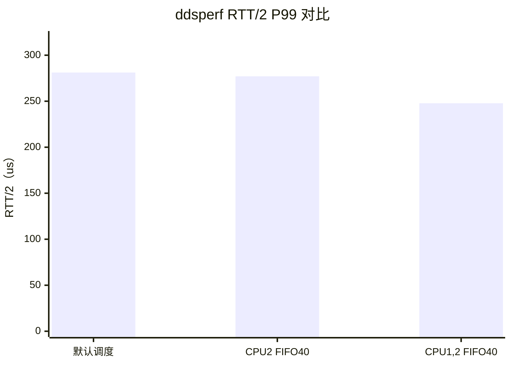
```mermaid
xychart-beta
    title "ddsperf RTT/2 P99 对比"
    x-axis ["默认调度", "CPU2 FIFO40", "CPU1,2 FIFO40"]
    y-axis "RTT/2（us）" 0 --> 320
    bar [281.211, 277.032, 247.832]
```

RTT/2 最大值：

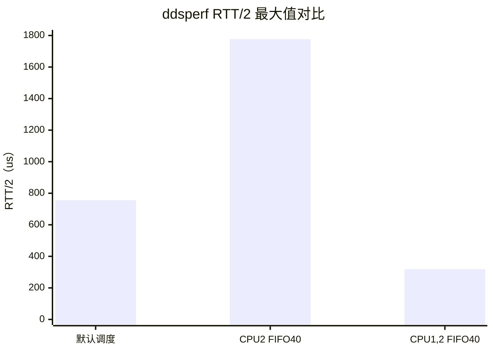
```mermaid
xychart-beta
    title "ddsperf RTT/2 最大值对比"
    x-axis ["默认调度", "CPU2 FIFO40", "CPU1,2 FIFO40"]
    y-axis "RTT/2（us）" 0 --> 1800
    bar [756.292, 1776.803, 319.051]
```

双物理核 CPU `1,2` + FIFO 40 同时降低了 P99 和最大值。单逻辑核 CPU 2
虽然减少了普通调度抢占，却因为 ddsperf 多线程共享一个逻辑核，使最大值
上升到 1776.803 µs。

为了排除测试时长差异，再比较三组测试的前 600 秒：

| 配置（前 600 秒） | 平均 RTT/2 | P50* | P90* | P99* | 最大值 | Ping 超时 | 非自愿切换/秒 |
|---|---:|---:|---:|---:|---:|---:|---:|
| 默认调度、不绑核 | 232.817 µs | 239.198 µs | 267.268 µs | 281.603 µs | 534.870 µs | 389 | 291.080 |
| CPU 2 + FIFO 40 | 232.563 µs | 243.102 µs | 260.722 µs | 271.060 µs | 1492.639 µs | 81 | 0.040 |
| CPU 1,2 + FIFO 40 | 207.195 µs | 212.242 µs | 236.485 µs | 247.832 µs | 319.051 µs | 3 | 0.107 |

双物理核测试的 600 个一秒窗口中，597 个窗口的最大值不超过
300 µs，另外 3 个位于 300～500 µs，没有超过 500 µs 的窗口。
三组测试的 `discarded/rexmit/throttle` 均为 0。

## 4. C++ 1 kHz Demo

### 4.1 通信模型与 QoS

Demo 位于 `myproject/samples/arm_state_1khz`，采用单向最新状态流：

```text
Publisher -- 1 ms/帧 --> Subscriber
```

使用的 QoS 为：

```text
Reliability   BestEffort
Durability    Volatile
History       KeepLast(1)
Deadline      2 ms
Lifespan      5 ms
```

- `BestEffort + KeepLast(1)` 优先保证新鲜状态，不会让旧状态在队列中堆积。
  它不承诺每帧必达，所以消息中加入 `sequence` 检查缺帧。
- `Deadline=2 ms` 是周期健康监视器：连续约两个发送周期没有新数据时报告
  Deadline miss。它不会等待或重发数据。
- `Lifespan=5 ms` 是样本年龄上限：超过五个控制周期的旧状态不再有消费
  价值。5 ms 是本次测试起点，产品中应根据机械臂允许的最大状态年龄调整。
- `Volatile` 表示只接收在线期间发布的数据，不向后来加入的 Reader 补历史。

### 4.2 Demo 优化过程

| 轮次 | 主要变化 | Publisher 结果 | Subscriber 结果 | 结论 |
|---|---|---|---|---|
| 1 | 每 60 s 排序并打印 | 写 599,652；跳 348；最大 37.185 ms | 收 599,533；缺口 465；最大 37.237 ms | 实时线程内排序/输出造成停顿 |
| 2 | 移除周期日志 | 写 599,970；跳 30；最大 19.032 ms | 收 599,948；缺口 39；最大 19.172 ms | 明显改善，但仍有动态扩容 |
| 3 | 增加诊断并预分配 | 远端仍运行旧 Publisher | 缺口出现在 65,539、131,079、262,158、524,320 附近 | `vector` 倍增扩容特征，同时发现部署版本不一致 |
| 4 | 两端均部署最终版本 | 写 600,000；跳 0；Deadline miss 0 | 收 599,992；缺口 0；最大间隔 1.301 ms | 600 秒筛选通过 |
| 5 | 最终版本长测 | 写 5,211,000；跳 0；Deadline miss 0 | 有效序列连续；缺口 0；最大间隔 1.377 ms | 5211 秒长测通过 |

最终版本采用以下措施：

- 使用绝对时间 `sleep_until()`，避免 `sleep_for()` 将每周期误差累计成漂移。
- 唤醒过晚时跳过已经失效的周期，不追赶式连发，并在序号中保留缺口。
- 所有统计数组在计时前按预计样本数 `reserve()`。
- 1 kHz 单线程数据路径中不排序、不打印，只在结束时输出汇总。
- 分别记录原始唤醒延迟、`write()` 耗时、统计耗时和 `take()` 耗时。

### 4.3 最终 5211 秒结果

Publisher：

| 指标 | 结果 |
|---|---:|
| 理论周期数 / 实际写入 | 5,211,000 / 5,211,000 |
| 跳过周期 | 0 |
| Offered Deadline miss | 0 |
| 发送间隔平均 / P99 / 最大 | 1000.000 / 1028.248 / 1157.212 µs |
| 唤醒延迟平均 / P99 / 最大 | 68.076 / 79.382 / 180.110 µs |
| `write()` 平均 / P99 / 最大 | 57.018 / 58.686 / 159.341 µs |
| 诊断异常 | 0 |

Subscriber 从序号 3 开始测量，完整收到序号 `3..5,211,000`：

| 指标 | 结果 |
|---|---:|
| 实际接收 | 5,210,998 |
| 序号缺口 / 重复 / 乱序 | 0 / 0 / 0 |
| 接收间隔平均 / P99 / 最大 | 1000.003 / 1200.257 / 1377.104 µs |
| 绝对抖动平均 / P99 / 最大 | 66.129 / 209.501 / 377.104 µs |
| `take()` 平均 / 最大 | 4.791 / 137.987 µs |
| Sample lost / rejected | 0 / 0 |
| 诊断异常 | 0 |

Subscriber 配置为 5271 秒，比 Publisher 多运行 60 秒。日志中的
`requested_deadline_missed=29992` 全部来自 Publisher 停止后的等待尾段：
`60 s / 2 ms ≈ 30000`。它不代表活跃传输期间发生了约三万次丢包。
活跃传输期间所有接收间隔均小于 2 ms，序号也连续。

C++ 5211 秒长测的 Publisher 与 Subscriber 周期尾延迟：

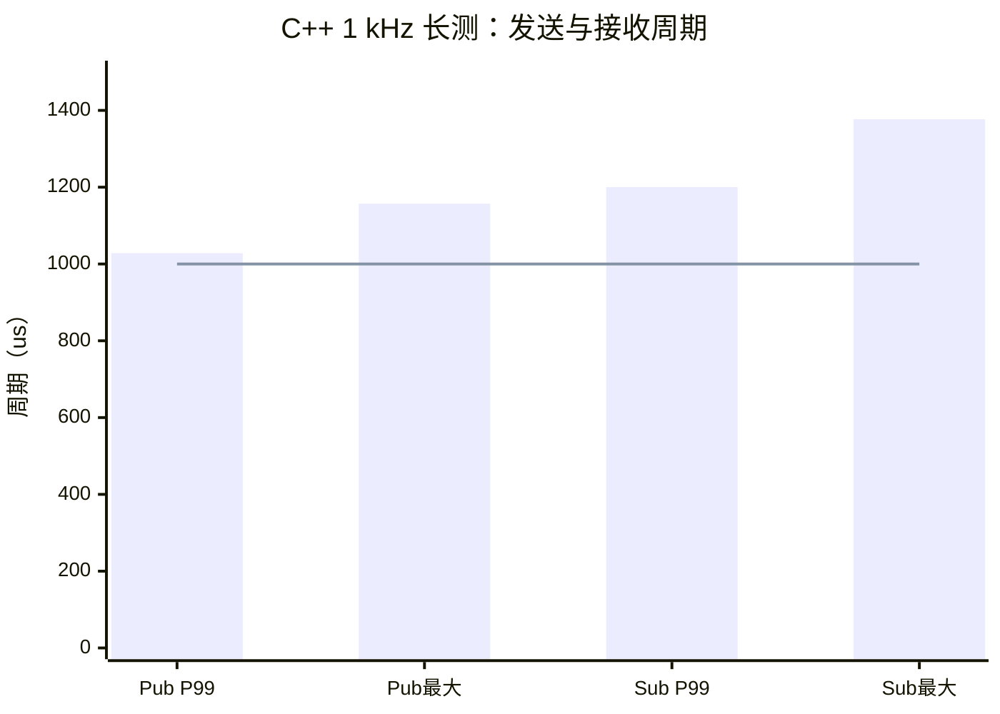
```mermaid
xychart-beta
    title "C++ 1 kHz 长测：发送与接收周期"
    x-axis ["Pub P99", "Pub最大", "Sub P99", "Sub最大"]
    y-axis "周期（us）" 0 --> 1500
    bar [1028.248, 1157.212, 1200.257, 1377.104]
    line [1000, 1000, 1000, 1000]
```

折线为理想 1000 µs 周期。绝对时间调度使 Publisher 长期平均保持
1000.000 µs，但单周期仍会受到系统唤醒抖动影响；Subscriber 又叠加了
DDS、网络和接收调度抖动。所有最大间隔仍小于 2 ms Deadline。

为了把 ddsperf 和 C++ 放在同一视图中，下面只比较相同单位的关键时间量。
各柱子的语义不同：ddsperf 是 RTT/2，Publisher 是本机唤醒延迟，
Subscriber 是相邻接收周期的绝对抖动，不能将它们当作同一种网络延迟直接
排名。ddsperf 数据来自 CPU `1,2` + FIFO 40 的 600 秒测试，C++ 数据来自
相同调度配置的 5211 秒测试。

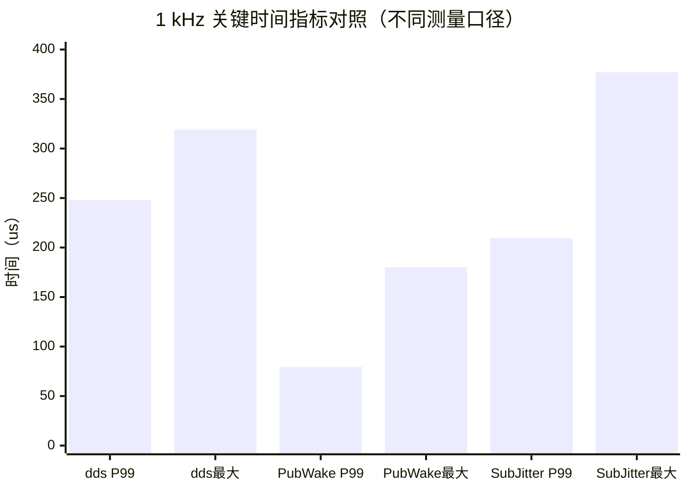
```mermaid
xychart-beta
    title "1 kHz 关键时间指标对照（不同测量口径）"
    x-axis ["dds P99", "dds最大", "PubWake P99", "PubWake最大", "SubJitter P99", "SubJitter最大"]
    y-axis "时间（us）" 0 --> 400
    bar [247.832, 319.051, 79.382, 180.110, 209.501, 377.104]
```

这张图适合观察各层时间预算的量级：

```text
ddsperf RTT/2       网络往返时延的一半
Publisher wake      发送线程相对计划时刻的本机唤醒延迟
Subscriber jitter   应用可见接收周期相对 1 ms 的绝对偏差
```

### 4.4 C++ 后续对比的统一指标口径

后续 C++ 基准、频率压力和 CPU 压力测试均使用同一组核心指标对比。这样
避免把不同语义的数字混在一起：

| 指标 | 所属端 | 含义 | 通过时重点 |
|---|---|---|---|
| Publisher 写入 / 跳周期 | Publisher | 是否按计划完成发送循环 | 写入数符合预期，跳周期为 0 |
| Publisher 间隔 P99 / 最大 | Publisher | 本机发送循环相邻两次 `write()` 的周期 | 最大值不要明显越过业务周期预算 |
| Wake P99 / 最大 | Publisher | 发送线程相对计划唤醒时刻的延迟 | 判断本机调度抖动 |
| Write 平均 / P99 / 最大 | Publisher | DDS `write()` 调用耗时 | 判断写入是否阻塞或异常变慢 |
| Subscriber 接收数 | Subscriber | 应用实际取到的样本数 | 结合首个序号和运行窗口解释 |
| Sequence gaps | Subscriber | 应用层序号缺口 | 判断是否有状态被覆盖或丢失 |
| Subscriber 间隔 P99 / 最大 | Subscriber | 应用可见的相邻接收周期 | 判断接收侧尾延迟 |
| Take 平均 / 最大 | Subscriber | DDS `take()` 调用耗时 | 判断读取路径是否异常变慢 |
| Deadline / lost / rejected | Subscriber | DDS 状态计数 | 只能辅助判断，不能替代 `sequence` |

其中最适合横向对比的是：

```text
Publisher 跳周期
Subscriber sequence_gaps
Publisher 最大间隔 - 目标周期
Subscriber 最大间隔 - 目标周期
Wake 最大值
Write 最大值
Take 最大值
```

对于 1 kHz、2 kHz、5 kHz 这类不同频率测试，直接比较“最大间隔”会受目标
周期影响。因此图表中优先使用“最大超周期量”：

```text
最大超周期量 = 最大相邻周期 - 目标周期
```

例如 1 kHz 目标周期是 1000 µs，Subscriber 最大间隔为 1377.104 µs，
则最大超周期量为 377.104 µs。这个值比直接比较 1377.104 µs 更适合跨频率
观察调度和接收尾部抖动。

## 5. 结论

1. 当前机器上，CPU `1,2` + `SCHED_FIFO 40` 是今天筛选出的最佳配置。
   单独绑定一个逻辑核会让 ddsperf 内部线程互相争用，不建议使用。
2. C++ 最终版本连续运行 5211 秒，Publisher 没有错过任何 1 ms 周期；
   Subscriber 在加入通信后收到完整连续序列。
3. 当前结果证明的是“本测试环境下的稳定 1 kHz 最新状态传输”，不是
   DDS BestEffort 的形式化必达保证。产品逻辑仍应监视 sequence、Deadline
   和状态年龄，并为通信中断设计安全降级。
4. 如果要测真实单向网络时延，需要两端使用 PTP/硬件时间戳同步，并在消息
   中携带同一时钟域的发送时间。
5. 2026-07-06 的 CPU 压力结果进一步表明：Publisher 在所有 CPU 档位中
   都保持零跳周期；但 BestEffort + KeepLast(1) 在部分接收压力场景会覆盖
   中间状态，不能用于证明“每一帧必达”。完整结果见 7.8。

## 6. 复测建议

- 短筛选：先运行 600 秒，确认没有序号缺口、跳周期和大于 2 ms 的间隔。
- 长测：再运行 5211 秒。正式对比采用 Subscriber 比 Publisher 多运行，
  保证完整覆盖发送窗口；分析时排除 Publisher 停止后的预期 Deadline
  miss，以活跃发送期间的序号连续性判断丢帧。
- 每次保存内核、CPU 拓扑、IRQ、路由、配置和二进制哈希。
- 更新程序后先比较二进制 SHA-256，防止两台机器部署版本不一致。
- 测试期间不要在实时线程中打印逐帧或周期性日志。

可复用脚本位于 `performance/dds_1khz`，使用方法见该目录的
`README.md`。

## 7. 2026-07-06 压力测试追加结果

本轮沿用 CPU `1,2`、`SCHED_FIFO 40`、BestEffort、Volatile、
KeepLast(1)、Deadline 2 ms 和 Lifespan 5 ms。测试分为 C++ 发送频率
压力与 ddsperf 消息大小压力两部分。

### 7.1 C++ 1 kHz 冒烟复测

重新部署压缩包后先执行 60 秒、128 B、1 kHz 冒烟测试。

| 指标 | Publisher | Subscriber |
|---|---:|---:|
| 理论周期 / 写入 | 60,000 / 60,000 | — |
| 接收数量 | — | 59,998 |
| 首个序号 | — | 3 |
| 序号缺口 / 重复 / 乱序 | — | 0 / 0 / 0 |
| 间隔 P99 | 1003.778 µs | 1198.520 µs |
| 最大间隔 | 1112.065 µs | 1308.254 µs |
| 最大 wake / write / take | 116.828 / 121.988 / — µs | — / — / 33.043 µs |
| Deadline miss | 0 | 2 |
| Sample lost / rejected | — | 0 / 0 |

Subscriber 的 2 次 Deadline miss 发生在 Publisher 停止后的短尾段。
活跃传输期间最大接收间隔小于 2 ms，序号 `3..60,000` 连续，因此冒烟
复测通过。

### 7.2 C++ 2 kHz 三轮压力测试

周期改为 500 µs。Run 1 两端均运行 600 秒；Run 2、Run 3 使用
Subscriber 600 秒、Publisher 602 秒，避免接收端停止前出现无数据尾段。

| 指标 | Run 1 | Run 2 | Run 3 | 最差值 |
|---|---:|---:|---:|---:|
| Publisher 写入 | 1,200,000 | 1,204,000 | 1,204,000 | 全部按计划写入 |
| Publisher 跳周期 | 0 | 0 | 0 | 0 |
| Publisher 间隔 P99 | 555.241 µs | 527.992 µs | 555.881 µs | 555.881 µs |
| Publisher 最大间隔 | 635.509 µs | 626.852 µs | 654.935 µs | 654.935 µs |
| 最大 wake | 152.182 µs | 166.442 µs | 171.549 µs | 171.549 µs |
| 最大 write | 121.111 µs | 128.215 µs | 153.715 µs | 153.715 µs |
| Subscriber 接收 | 1,199,946 | 1,200,003 | 1,199,961 | — |
| Subscriber 间隔 P99 | 618.980 µs | 598.312 µs | 624.011 µs | 624.011 µs |
| Subscriber 最大间隔 | 722.938 µs | 710.220 µs | 704.941 µs | 722.938 µs |
| 最大 take | 38.240 µs | 26.511 µs | 28.668 µs | 38.240 µs |
| 序号缺口 / 重复 / 乱序 | 0 / 0 / 0 | 0 / 0 / 0 | 0 / 0 / 0 | 全部为 0 |
| Deadline / lost / rejected | 全部为 0 | 全部为 0 | 全部为 0 | 全部为 0 |

2 kHz 三轮 Publisher 与 Subscriber 最大间隔：

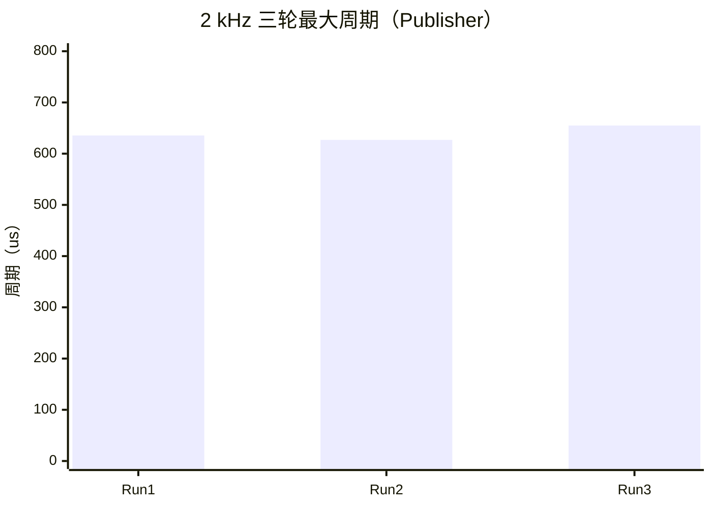
```mermaid
xychart-beta
    title "2 kHz 三轮最大周期（Publisher）"
    x-axis ["Run1", "Run2", "Run3"]
    y-axis "周期（us）" 0 --> 800
    bar [635.509, 626.852, 654.935]
```

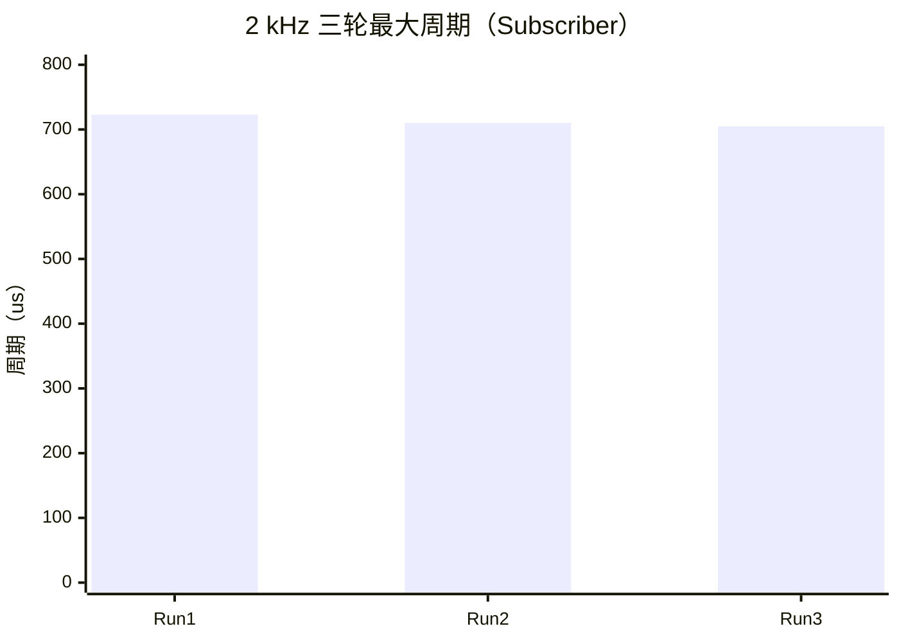
```mermaid
xychart-beta
    title "2 kHz 三轮最大周期（Subscriber）"
    x-axis ["Run1", "Run2", "Run3"]
    y-axis "周期（us）" 0 --> 800
    bar [722.938, 710.220, 704.941]
```

两端使用各自主机的 `steady_clock`。Run 1 中 Publisher 本机平均周期为
500.000 µs，而 Subscriber 测得 500.023 µs，约有 46 ppm 的时钟频率差。
600 秒可累计约 27.6 ms 的测量窗口差，因此两端总数量不能直接用于判定
丢包；三轮的应用可见序号均连续。2 kHz 三轮压力测试通过。

### 7.3 C++ 5 kHz 边界测试

周期改为 200 µs，Subscriber 运行 600 秒，Publisher 运行 602 秒。

Publisher：

```text
scheduled/written       3,010,000 / 3,010,000
skipped_cycles          0
offered_deadline_missed 0
interval P99/max        203.502 / 343.623 us
wake max                146.318 us
write max               123.766 us
```

Subscriber：

```text
received                2,999,968
sequence_gaps           9
duplicates/out_of_order 0 / 0
interval P99/max        272.167 / 418.924 us
take max                30.731 us
deadline/lost/rejected  0 / 0 / 0
```

应用层序号缺口对比：

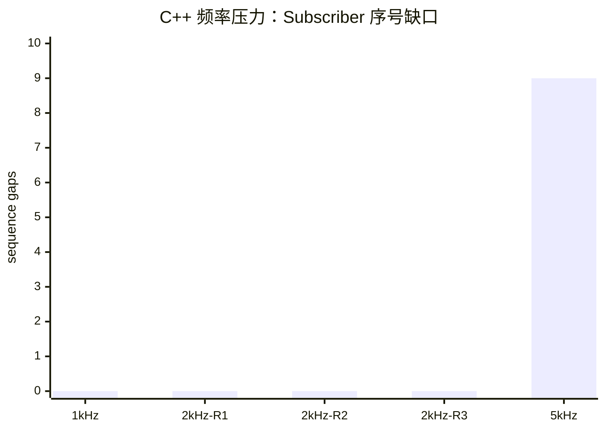
```mermaid
xychart-beta
    title "C++ 频率压力：Subscriber 序号缺口"
    x-axis ["1kHz", "2kHz-R1", "2kHz-R2", "2kHz-R3", "5kHz"]
    y-axis "sequence gaps" 0 --> 10
    bar [0, 0, 0, 0, 9]
```

9 个缺口均为单帧缺口，对应接收间隔约 350～419 µs，缺口比例约
0.0003%。Publisher 没有跳周期，因此缺口发生在 Writer 之后至应用 Reader
可见之前。BestEffort + KeepLast(1) 下，DDS 的 `sample_lost=0` 不代表
应用序号必然连续，应以 `sequence_gaps` 为准。

5 kHz 已越过本测试的“零序号缺口”边界，但这不影响正式 1 kHz 结论。
已有结果表明 1 kHz 长测通过、2 kHz 三轮通过，5 kHz 开始出现少量缺口。

### 7.4 ddsperf 1 kHz 消息大小压力

网卡 `enp0s31f6` 为 1000 Mb/s 全双工、MTU 1500。固定频率 1 kHz，
逐步增加样本大小。表中的 P99 是每秒窗口 P99 的平均值。

| 大小 | 单向有效载荷 | RTT/2 平均 | RTT/2 P99 | RTT/2 最大 | 回复速率 | 周期超时计数 | 传输计数 | 60 秒短测结论 |
|---:|---:|---:|---:|---:|---:|---:|---|---|
| 32 KiB | 262.144 Mb/s | 515.383 µs | 590.356 µs | 952.455 µs | 998.000/s | 42,818 | 全部为 0 | 60 秒通过 |
| 48 KiB | 393.216 Mb/s | 671.827 µs | 740.038 µs | 851.886 µs | 998.067/s | 59,186 | 全部为 0 | 60 秒通过，需长测 |
| 56 KiB | 458.752 Mb/s | 716.486 µs | 807.508 µs | 898.980 µs | 997.967/s | 59,182 | 全部为 0 | 60 秒通过，需长测 |
| 60 KiB | 491.520 Mb/s | 736.148 µs | 809.531 µs | 993.506 µs | 997.967/s | 59,183 | 全部为 0 | 60 秒临界 |
| 62 KiB | 507.904 Mb/s | 732.539 µs | 792.662 µs | 986.297 µs | 997.967/s | 59,184 | 全部为 0 | 60 秒临界 |
| 64 KiB | 524.288 Mb/s | 819.955 µs | 966.007 µs | 1112.443 µs | 997.950/s | 59,184 | 全部为 0 | 60 秒未通过 |

柱子为各消息大小在 60 秒测试中的 RTT/2 最大值；折线为 1000 µs
单向筛选阈值。

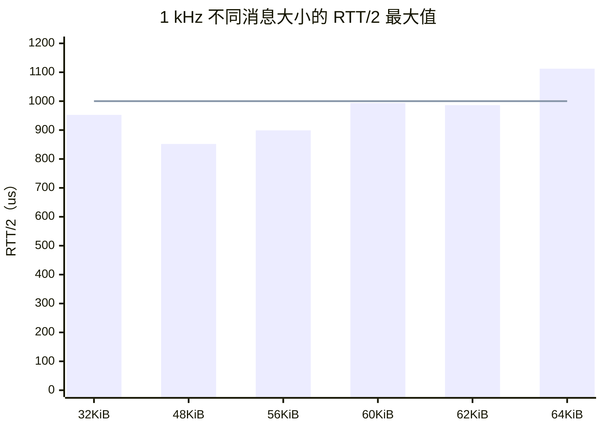
```mermaid
xychart-beta
    title "1 kHz 不同消息大小的 RTT/2 最大值"
    x-axis ["32KiB", "48KiB", "56KiB", "60KiB", "62KiB", "64KiB"]
    y-axis "RTT/2（us）" 0 --> 1200
    bar [952.455, 851.886, 898.980, 993.506, 986.297, 1112.443]
    line [1000, 1000, 1000, 1000, 1000, 1000]
```

“传输计数全部为 0”表示 `discarded/rexmit/Tthrottle/Nthrottle` 均为 0。
RTT/2 只是对称链路条件下的单向时延近似，不是经过 PTP 同步得到的真实
单向时延。

ddsperf 在固定 1 kHz 模式下，如果上一个 Pong 未在下一个 Ping 周期前返回，
就增加 `ping timed out`，即使该 Pong 稍后仍然到达。因此大消息测试中的
周期超时计数不能解释成丢包数，也不能使用
`timeouts / (RTT samples + timeouts)` 计算丢包率。大消息测试仍收到约
998 个 RTT 样本/秒，且传输计数为 0。

60 秒短测只用于筛选候选档位，不能证明长期稳定。短测显示 60～62 KiB
已非常接近 1 ms 边界，单次最大值又受调度随机峰值影响，不能作为稳定
工程上限。基于短测结果，56 KiB 进入高负载长测验证，48 KiB 进入较保守
长测验证。最终是否可作为长期余量，以后续 1800 秒长测为准：

```text
短测极限区间        60～64 KiB
高负载长测候选      56 KiB
较保守长测候选      48 KiB
```

换句话说，48/56 KiB 在这里不是“最终长期通过”，而是“60 秒短测通过”。
后续 30 分钟长测发现尾延迟越界后，它们不能作为严格长期余量。

### 7.5 56 KiB、30 分钟连续测试

执行 `1 kHz × 56 KiB × 1800 秒` 连续测试，用于验证 60 秒短测结论能否
在更长时间内保持。

| 指标 | 结果 |
|---|---:|
| 测试时长 / 一秒窗口 | 1800 s / 1800 |
| RTT 样本 / 回复速率 | 1,796,578 / 998.099 每秒 |
| RTT/2 平均 | 718.300 µs |
| 每秒窗口 P50 / P90 / P99 平均 | 716.466 / 775.394 / 811.181 µs |
| RTT/2 最大值 | 1587.765 µs |
| 最大值不超过 1 ms 的窗口 | 1796 |
| 最大值超过 1 ms 的窗口 | 4 |
| discarded / rexmit / throttle | 0 / 0 / 0 |
| RSS 平均 / 最大 | 5.337 / 5.500 MB |
| 非自愿切换平均 / 最大 | 0.157 / 3 每秒 |

4 个越过 1 ms 阈值的窗口如下：

| 测试时刻 | P99 | 最大值 | RTT 样本数 |
|---:|---:|---:|---:|
| 107 s | 1016.693 µs | 1365.970 µs | 998 |
| 108 s | 1363.244 µs | 1587.765 µs | 1000 |
| 109 s | 1358.958 µs | 1500.725 µs | 1000 |
| 440 s | 841.827 µs | 1178.108 µs | 998 |

异常窗口最大值与 1000 µs 阈值：

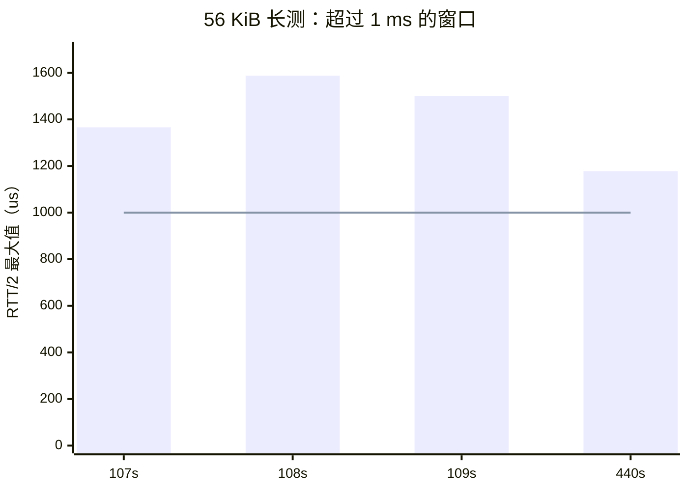
```mermaid
xychart-beta
    title "56 KiB 长测：超过 1 ms 的窗口"
    x-axis ["107s", "108s", "109s", "440s"]
    y-axis "RTT/2 最大值（us）" 0 --> 1700
    bar [1365.970, 1587.765, 1500.725, 1178.108]
    line [1000, 1000, 1000, 1000]
```

107～109 秒连续出现三秒尾延迟抬升，440 秒又出现一次孤立峰值；与此同时
回复速率保持约 998/s，`discarded/rexmit/throttle` 全为 0。这说明主要问题
是少量尾延迟峰值，而不是持续带宽不足或 DDS 传输节流。

按照“全部一秒窗口的 RTT/2 最大值均小于 1 ms”的严格验收条件，56 KiB
的 30 分钟测试未通过。56 KiB 仍可作为极限压力档位，但不再作为长期余量
配置；下一步应对 48 KiB 执行相同的 1800 秒测试：

```text
56 KiB    极限压力档位
48 KiB    长期余量候选，30 分钟结果见 7.6
```

### 7.6 48 KiB、三轮 30 分钟连续测试

将消息大小降至 48 KiB，保持 1 kHz 和每轮 1800 秒不变，连续执行三轮，
验证长期余量结果能否重复。

| 指标 | Run 1 | Run 2 | Run 3 |
|---|---:|---:|---:|
| RTT 样本 | 1,796,397 | 1,796,452 | 1,796,400 |
| 回复速率 | 997.998/s | 998.029/s | 998.000/s |
| RTT/2 平均 | 669.215 µs | 663.353 µs | 660.294 µs |
| 每秒窗口 P99 平均 | 749.070 µs | 733.268 µs | 727.557 µs |
| RTT/2 最大值 | 979.901 µs | 1116.837 µs | 1149.156 µs |
| 最大值超过 1 ms 的窗口 | 0 | 2 | 2 |
| discarded / rexmit / throttle | 0 / 0 / 0 | 0 / 0 / 0 | 0 / 0 / 0 |
| RSS 最大 | 5.700 MB | 5.700 MB | 5.700 MB |
| 非自愿切换最大 | 4/s | 2/s | 2/s |

三轮最大值与 1000 µs 阈值：

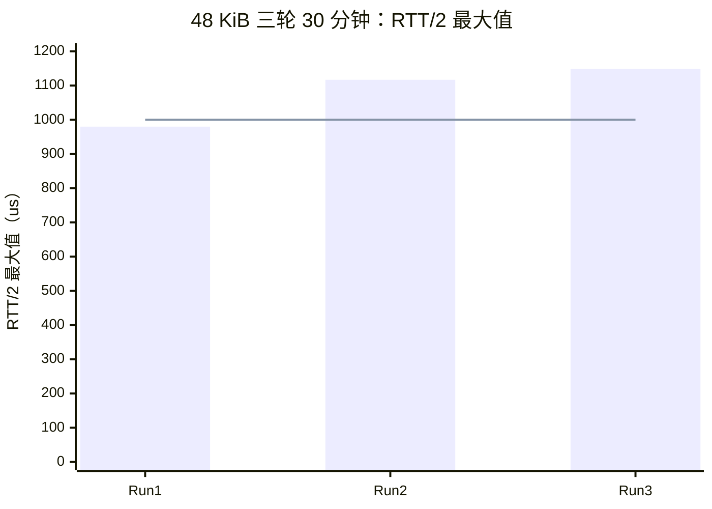
```mermaid
xychart-beta
    title "48 KiB 三轮 30 分钟：RTT/2 最大值"
    x-axis ["Run1", "Run2", "Run3"]
    y-axis "RTT/2 最大值（us）" 0 --> 1200
    bar [979.901, 1116.837, 1149.156]
    line [1000, 1000, 1000]
```

Run 2 和 Run 3 的越界窗口：

| 轮次 | 测试时刻 | P99 | 最大值 | RTT 样本数 |
|---|---:|---:|---:|---:|
| Run 2 | 879 s | 739.379 µs | 1116.837 µs | 997 |
| Run 2 | 988 s | 720.805 µs | 1086.102 µs | 998 |
| Run 3 | 1057 s | 734.495 µs | 1149.156 µs | 996 |
| Run 3 | 1058 s | 728.704 µs | 1084.195 µs | 998 |

三轮的平均值、P99、回复速率和传输计数都很稳定，越界来自极少数尾延迟
峰值，并非持续带宽不足。但按照“每一轮所有一秒窗口的 RTT/2 最大值均小于
1 ms”的严格标准，三轮中只有 Run 1 通过，48 KiB 不具备可重复的长期严格
余量。

带宽压力结论更新为：

```text
56 KiB    极限压力档位，30 分钟出现 4 个越界窗口
48 KiB    三轮中两轮出现越界，不作为严格长期余量
40 KiB    下一长期余量候选
```

下一步应先对 40 KiB 执行一轮 1800 秒筛选；通过后再决定是否重复两轮。

### 7.7 40 KiB、30 分钟连续测试

继续将消息大小降至 40 KiB，保持 1 kHz 和 1800 秒，检查减少带宽后尾延迟
是否按比例下降。

| 指标 | 结果 |
|---|---:|
| RTT 样本 / 回复速率 | 1,796,252 / 997.918 每秒 |
| RTT/2 平均 | 563.433 µs |
| 每秒窗口 P50 / P90 / P99 平均 | 550.796 / 617.832 / 640.426 µs |
| RTT/2 最大值 | 1164.465 µs |
| 最大值超过 1 ms 的窗口 | 60 / 1800 |
| 一秒窗口 P99 超过 800 µs | 4 / 1800 |
| 一秒窗口 P99 超过 1 ms | 0 / 1800 |
| discarded / rexmit / throttle | 0 / 0 / 0 |
| RSS 平均 / 最大 | 6.181 / 6.400 MB |
| 非自愿切换平均 / 最大 | 0.054 / 3 每秒 |

平均值、P99 与孤立最大值：

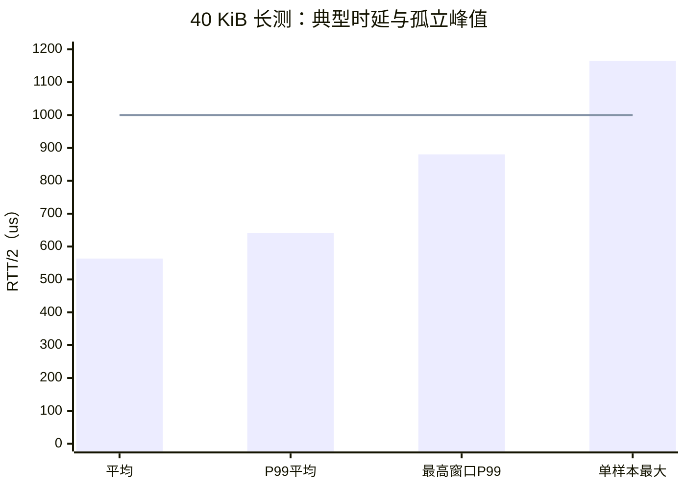
```mermaid
xychart-beta
    title "40 KiB 长测：典型时延与孤立峰值"
    x-axis ["平均", "P99平均", "最高窗口P99", "单样本最大"]
    y-axis "RTT/2（us）" 0 --> 1200
    bar [563.433, 640.426, 880.368, 1164.465]
    line [1000, 1000, 1000, 1000]
```

40 KiB 的平均值和 P99 明显低于 48/56 KiB，回复速率保持约 998/s，且所有
传输计数为 0，因此带宽吞吐测试通过。但仍有 60 个一秒窗口包含至少一个
超过 1 ms 的孤立最大值，而且其出现次数反而多于部分更大消息测试。

这一非单调结果说明，长测中的单样本最大值已经主要受到调度、中断、网卡
批处理或其他瞬时系统活动影响，而不是只由消息大小决定。继续减小消息，
不能保证数百万个样本中永远不出现一次 RTT/2 峰值。

因此需要区分两种验收口径：

```text
带宽容量：
  回复速率、平均值、P99、discarded/rexmit/throttle 和持续恶化趋势

硬实时尾延迟：
  单样本最大值、Deadline 和应用 sequence；需要真实单向时间同步或
  C++ 应用测试，不能仅以 ddsperf RTT/2 最大值代替
```

40 KiB 在 1GbE 上对应约 327.68 Mb/s 单向有效载荷，本轮没有持续带宽不足
迹象。消息大小压力测试到此可以结束，后续转入固定 1 kHz、128 B C++ Demo
的 CPU 压力测试。

### 7.8 C++ 1 kHz CPU 压力测试

CPU 压力阶段保持业务参数不变：

```text
Publisher          600 s
Subscriber         620 s
发送周期           1000 us
消息大小           约 128 B
DDS CPU            1,2
DDS 调度           SCHED_FIFO 40
QoS                BestEffort / Volatile / KeepLast(1)
Deadline/Lifespan  2 ms / 5 ms
```

Subscriber 多运行 20 秒以覆盖完整发送窗口。Publisher 停止后的尾段会产生
约 `20 s / 2 ms = 10000` 次 `requested_deadline_missed`，这部分是预期
结果，不计入活跃传输阶段失败。

CPU 正式矩阵开始前的两轮预备测试曾反向使用 Subscriber 600 秒、
Publisher 602 秒。Subscriber 的统计数组按理论值预留约 600001 条，但两台
主机的时钟频率差使其在 600 秒内记录到约 600008 条，尾部触发 `vector`
扩容并复制整组统计数据。这两轮存在测试程序自扰，不纳入下表。正式矩阵
恢复 Subscriber 620 秒、Publisher 600 秒后，统计容量足以覆盖发送窗口。

#### 7.8.1 CPU-0～CPU-6 首轮结果

`stress-ng` 使用两个普通 `SCHED_OTHER` worker，固定在指定的两个逻辑 CPU，
目标负载 80%，持续 620 秒。所有压力日志均显示成功完成，有效负载约
79.89%～80.00%。

| 测试 | 压力位置 | 压力 CPU | Pub P99 / 最大 | Wake P99 / 最大 | Sub P99 / 最大 | 序号缺口 | 严格结论 |
|---|---|---|---:|---:|---:|---:|---|
| CPU-0 | 无 | — | 1024.000 / 1084.218 µs | 56.613 / 100.776 µs | 1201.468 / 2102.962 µs | 1 | 未通过 |
| CPU-1 | 发送端 | `0,4` | 1031.357 / 1151.797 µs | 135.788 / 162.352 µs | 1190.932 / 1400.150 µs | 0 | 通过 |
| CPU-2 | 接收端 | `0,4` | 1024.224 / 1123.308 µs | 75.726 / 157.575 µs | 1104.432 / 2000.796 µs | 1 | 未通过 |
| CPU-3 | 两端 | `0,4` | 1033.570 / 1154.684 µs | 136.659 / 178.797 µs | 1117.870 / 2088.325 µs | 0 | 时延未通过 |
| CPU-4 | 发送端 | `5,6` | 1009.786 / 1152.071 µs | 138.054 / 172.501 µs | 1201.562 / 1862.154 µs | 0 | 通过 |
| CPU-5 | 接收端 | `5,6` | 1032.461 / 1129.558 µs | 57.273 / 154.008 µs | 1144.717 / 1450.314 µs | 0 | 通过 |
| CPU-6 | 两端 | `5,6` | 1001.799 / 1137.299 µs | 20.753 / 141.888 µs | 1141.097 / 2089.989 µs | 2 | 未通过 |

所有测试的 Publisher 均满足：

```text
scheduled_cycles = written = 600000
skipped_cycles = 0
offered_deadline_missed = 0
```

各档应用层序号缺口：

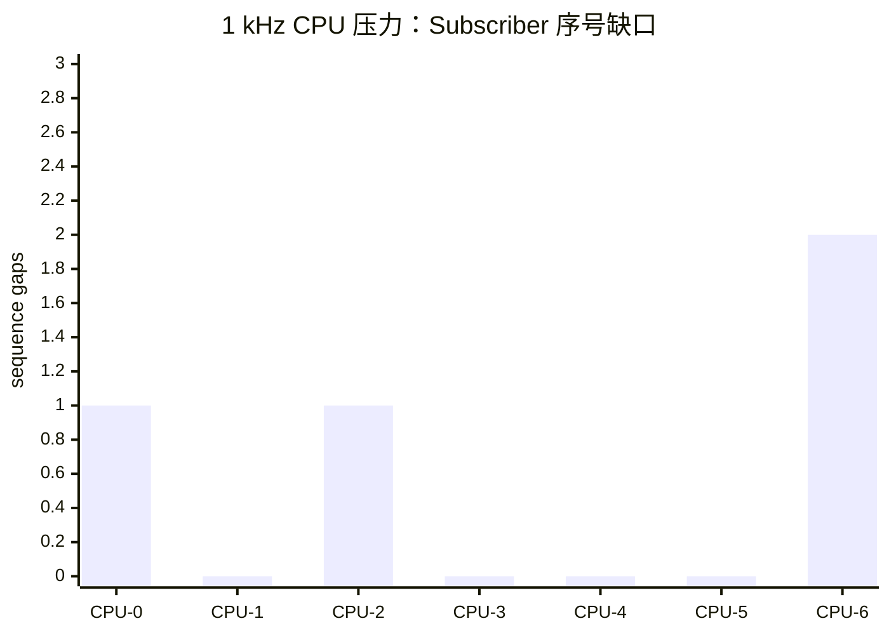
```mermaid
xychart-beta
    title "1 kHz CPU 压力：Subscriber 序号缺口"
    x-axis ["CPU-0", "CPU-1", "CPU-2", "CPU-3", "CPU-4", "CPU-5", "CPU-6"]
    y-axis "sequence gaps" 0 --> 3
    bar [1, 0, 1, 0, 0, 0, 2]
```

Subscriber 最大接收间隔；折线为 2 ms 严格阈值：

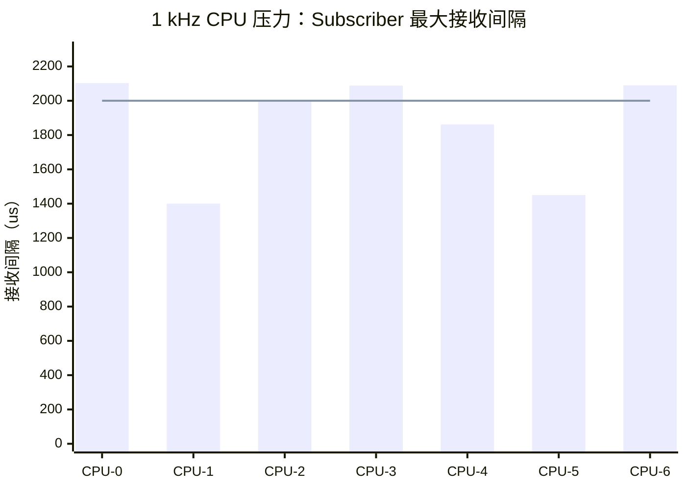
```mermaid
xychart-beta
    title "1 kHz CPU 压力：Subscriber 最大接收间隔"
    x-axis ["CPU-0", "CPU-1", "CPU-2", "CPU-3", "CPU-4", "CPU-5", "CPU-6"]
    y-axis "接收间隔（us）" 0 --> 2300
    bar [2102.962, 1400.150, 2000.796, 2088.325, 1862.154, 1450.314, 2089.989]
    line [2000, 2000, 2000, 2000, 2000, 2000, 2000]
```

CPU `0,4` 是未运行 DDS 的一对物理核/超线程；CPU `5,6` 分别与 DDS 使用
的 CPU `1,2` 共享物理核。CPU-1～CPU-5 没有呈现“压力越大，序号缺口必然
单调增加”的趋势，说明单次孤立事件仍受到调度、中断和网络批处理影响。
CPU-6 是两端同时争用 DDS 所在物理核的最重场景，因此追加两轮复测。

#### 7.8.2 CPU-6 三轮复测

三轮均在发送端和接收端的 CPU `5,6` 上施加两个 80% worker，压力日志均
完整覆盖测试窗口。

| 指标 | Run 1 | Run 2 | Run 3 |
|---|---:|---:|---:|
| Publisher 写入 / 跳周期 | 600000 / 0 | 600000 / 0 | 600000 / 0 |
| Publisher P99 / 最大 | 1001.799 / 1137.299 µs | 1013.850 / 1147.100 µs | 1015.758 / 1156.130 µs |
| Wake P99 / 最大 | 20.753 / 141.888 µs | 137.974 / 173.221 µs | 138.526 / 183.228 µs |
| Subscriber P99 / 最大 | 1141.097 / 2089.989 µs | 1147.827 / 2062.459 µs | 1141.008 / 1998.306 µs |
| Subscriber 序号缺口 | 2 | 2 | 3 |
| 重复 / 乱序 | 0 / 0 | 0 / 0 | 0 / 0 |
| Sample lost / rejected | 0 / 0 | 0 / 0 | 0 / 0 |

CPU-6 三轮序号缺口：

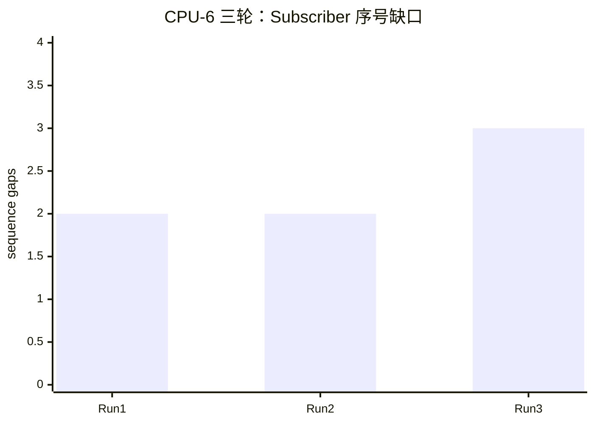
```mermaid
xychart-beta
    title "CPU-6 三轮：Subscriber 序号缺口"
    x-axis ["Run1", "Run2", "Run3"]
    y-axis "sequence gaps" 0 --> 4
    bar [2, 2, 3]
```

CPU-6 三轮最大接收间隔：

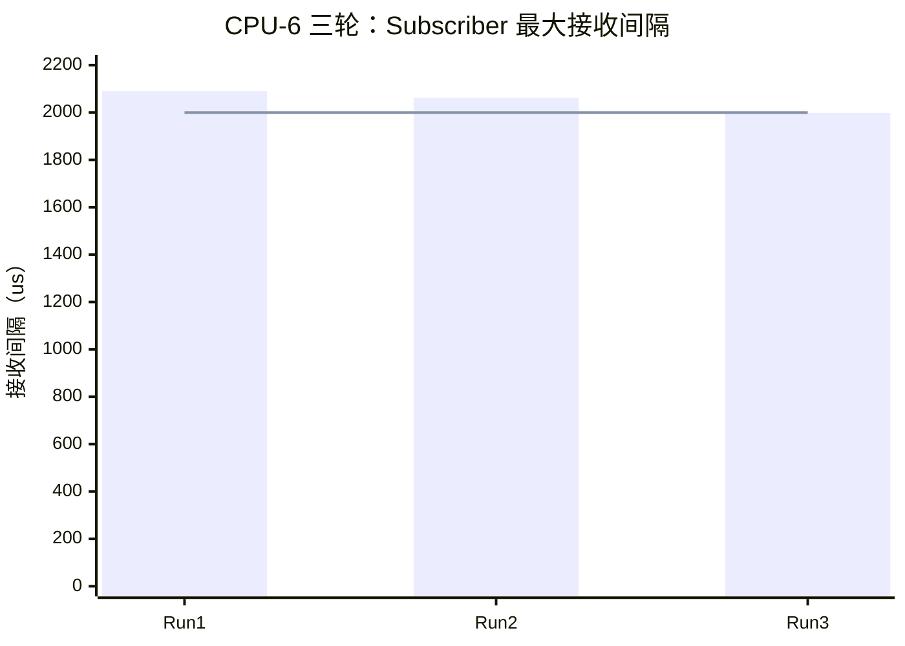
```mermaid
xychart-beta
    title "CPU-6 三轮：Subscriber 最大接收间隔"
    x-axis ["Run1", "Run2", "Run3"]
    y-axis "接收间隔（us）" 0 --> 2200
    bar [2089.989, 2062.459, 1998.306]
    line [2000, 2000, 2000]
```

三轮合计：

```text
Publisher 写入        1,800,000
Publisher 跳周期      0
Subscriber 序号缺口   7
缺口比例              约 0.000389%
序号完整率            约 99.999611%
```

Run 3 中序号 299204 出现单帧缺口，但对应接收间隔仅 1003.422 µs。
这证明只比较相邻接收时间差会漏掉一部分覆盖事件，`sequence` 连续性必须
保留为独立验收指标。DDS 状态中的 `sample_lost=0` 同样不能替代应用层
序号检查。

#### 7.8.3 CPU 压力结论

1. Publisher 在全部 CPU 档位和 CPU-6 三轮复测中均按计划完成 1 kHz
   发送，说明绝对时间调度、CPU `1,2` 和 FIFO 40 对发送侧保护有效。
2. 接收侧在 CPU-0、CPU-2 和 CPU-6 出现应用层单帧缺口。CPU-6 三轮均
   复现，说明两端同时争用 DDS 物理核时存在稳定但极低概率的覆盖风险。
3. `BestEffort + KeepLast(1)` 的语义是优先保留最新状态，而不是每帧必达。
   如果机械臂业务只消费最新状态，可以把当前结果作为降级概率数据，但仍
   必须监控 sequence、Deadline 和状态年龄。
4. 如果业务要求每一帧都被应用读取，当前 QoS 不满足需求。下一阶段应对比
   `BestEffort + KeepLast(8/16)` 与 `Reliable + KeepLast(8/16)`，同时
   评估排队、追赶式读取、Writer 阻塞和状态陈旧风险。

### 7.9 C++ 基准与压力测试同口径对比

本节只比较 C++ `arm_state_1khz` Demo，不混入 ddsperf 的 RTT/2。ddsperf
用于链路往返能力筛选；C++ Demo 用于验证机械臂状态流在应用层看到的发送、
接收、序号连续性和调用耗时。

#### 7.9.1 Publisher 同口径摘要

表中的“最差”表示该字段在对应测试组内独立取最坏值，不要求同一行所有
最差值都来自同一次运行。

| 场景 | 目标周期 | 时长 | 写入 / 跳周期 | 间隔 P99 / 最大 | Wake P99 / 最大 | Write P99 / 最大 |
|---|---:|---:|---:|---:|---:|---:|
| 1 kHz 长测基准 | 1000 µs | 5211 s | 5,211,000 / 0 | 1028.248 / 1157.212 µs | 79.382 / 180.110 µs | 58.686 / 159.341 µs |
| 1 kHz 冒烟复测 | 1000 µs | 60 s | 60,000 / 0 | 1003.778 / 1112.065 µs | 24.173 / 116.828 µs | 58.572 / 121.988 µs |
| 2 kHz 三轮最差 | 500 µs | 600～602 s | 全部按计划 / 0 | 555.881 / 654.935 µs | — / 171.549 µs | — / 153.715 µs |
| 5 kHz 边界 | 200 µs | 602 s | 3,010,000 / 0 | 203.502 / 343.623 µs | — / 146.318 µs | — / 123.766 µs |
| 1 kHz CPU 压力最差 | 1000 µs | 600 s | 全部 600,000 / 0 | 1033.570 / 1156.130 µs | 138.526 / 183.228 µs | — |

Publisher 侧所有正式 C++ 测试均满足：

```text
skipped_cycles = 0
offered_deadline_missed = 0
```

也就是说，目前问题不在发送循环“发不出去”，而在接收侧在压力下是否能把每
一个最新状态都交给应用读取。

#### 7.9.2 Subscriber 同口径摘要

表中的“最差”同样表示字段级最坏值；如果要追溯某个具体异常，应回到前面
各轮详细表格查看对应 Run。

| 场景 | 目标周期 | 接收数 | Sequence gaps | 间隔 P99 / 最大 | 最大超周期量 | Take 最大 | 结论 |
|---|---:|---:|---:|---:|---:|---:|---|
| 1 kHz 长测基准 | 1000 µs | 5,210,998 | 0 | 1200.257 / 1377.104 µs | 377.104 µs | 137.987 µs | 通过 |
| 1 kHz 冒烟复测 | 1000 µs | 59,998 | 0 | 1198.520 / 1308.254 µs | 308.254 µs | 33.043 µs | 通过 |
| 2 kHz 三轮最差 | 500 µs | — | 0 | 624.011 / 722.938 µs | 222.938 µs | 38.240 µs | 通过 |
| 5 kHz 边界 | 200 µs | 2,999,968 | 9 | 272.167 / 418.924 µs | 218.924 µs | 30.731 µs | 序号未通过 |
| 1 kHz CPU 压力首轮最差 | 1000 µs | — | 2 | 1201.562 / 2102.962 µs | 1102.962 µs | — | 未通过 |
| 1 kHz CPU-6 三轮合计 | 1000 µs | — | 7 / 1,800,000 | 1147.827 / 2089.989 µs | 1089.989 µs | — | 未通过 |

说明：

- `接收数` 在不同主机时钟和不同起止窗口下不能单独用于判断丢包，正式判断
  以 `sequence_gaps` 为准。
- CPU 压力表中的 `1 kHz CPU 压力首轮最差` 使用所有首轮 CPU 档位中的最坏
  Subscriber 最大间隔；`1 kHz CPU-6 三轮合计` 使用 CPU-6 三轮复测中的
  合计缺口和最坏最大间隔。
- `requested_deadline_missed` 在 Subscriber 比 Publisher 多运行的尾段会
  按 `尾段时长 / Deadline` 增加，这部分是预期现象，不能直接解释为活跃
  传输期间丢包。

#### 7.9.3 C++ 横向对比图

下面两张图使用同一口径：第一张看是否出现应用层序号缺口，第二张看相对
目标周期的最大超周期量。

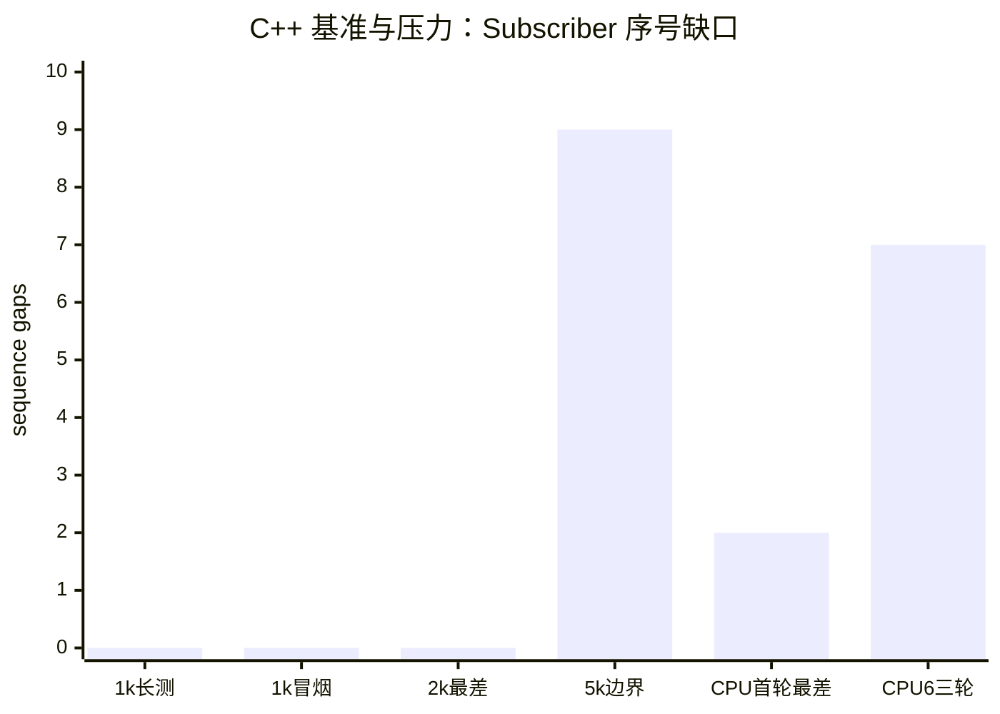
```mermaid
xychart-beta
    title "C++ 基准与压力：Subscriber 序号缺口"
    x-axis ["1k长测", "1k冒烟", "2k最差", "5k边界", "CPU首轮最差", "CPU6三轮"]
    y-axis "sequence gaps" 0 --> 10
    bar [0, 0, 0, 9, 2, 7]
```

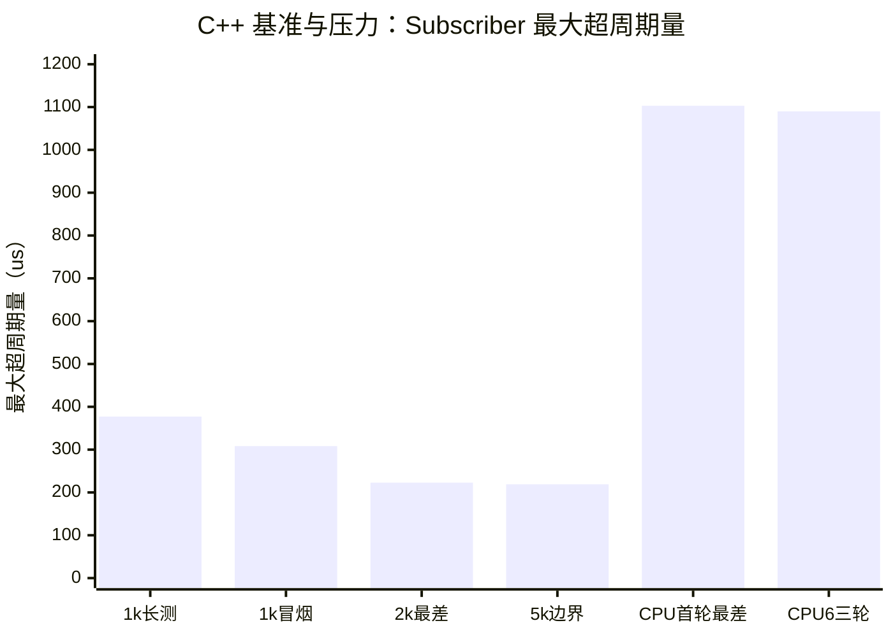
```mermaid
xychart-beta
    title "C++ 基准与压力：Subscriber 最大超周期量"
    x-axis ["1k长测", "1k冒烟", "2k最差", "5k边界", "CPU首轮最差", "CPU6三轮"]
    y-axis "最大超周期量（us）" 0 --> 1200
    bar [377.104, 308.254, 222.938, 218.924, 1102.962, 1089.989]
```

从这组同口径图可以看出：

1. 1 kHz 长测、1 kHz 冒烟和 2 kHz 三轮都保持 `sequence_gaps=0`。
2. 5 kHz 虽然最大超周期量不高，但出现 9 个序号缺口，说明仅看时间间隔会
   漏掉覆盖事件。
3. CPU 压力下的主要风险是接收侧尾延迟和极少量单帧缺口，而不是发送端跳
   周期。
4. 因此后续 QoS 压力测试应继续把 `sequence_gaps` 放在第一优先级，同时
   对比 `BestEffort + KeepLast(8/16)` 与 `Reliable + KeepLast(8/16)`。
