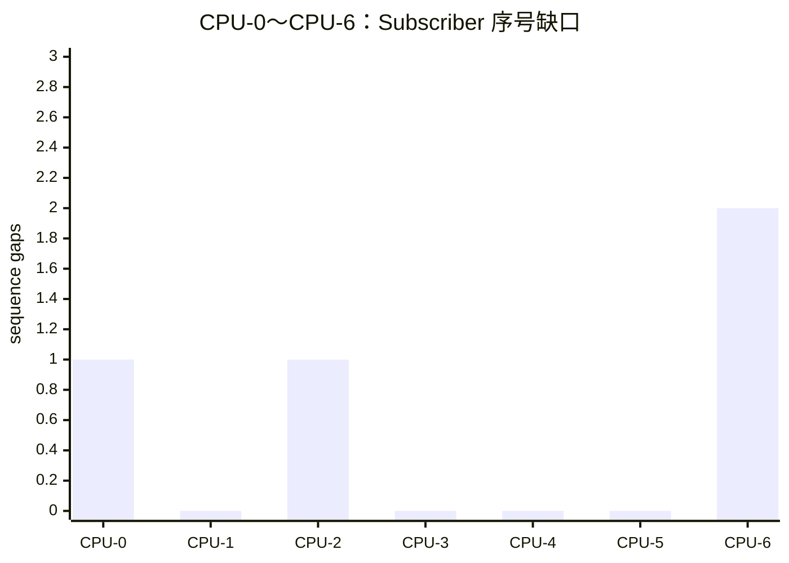
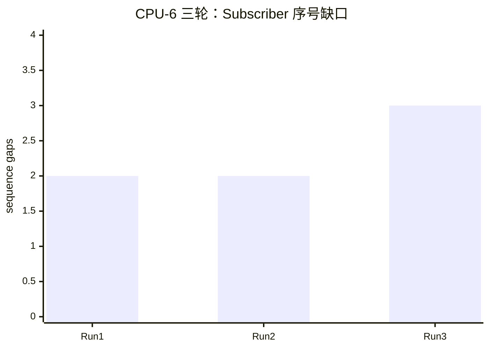

# Cyclone DDS 1 kHz 压力测试执行计划

- 适用版本：Cyclone DDS 0.10.5
- 正式业务频率：1 kHz
- 推荐调度：CPU `1,2`、`SCHED_FIFO 40`
- C++ QoS：BestEffort、Volatile、KeepLast(1)、Deadline 2 ms、
  Lifespan 5 ms

## 1. 测试目标

压力测试不是为了把正式频率改成 2 kHz 或 5 kHz，而是在保持正式 1 kHz
业务条件的基础上，验证系统面对下列压力时是否仍能保持周期和序号连续：

1. 网络带宽与大消息。
2. 发送端 CPU 负载。
3. 接收端 CPU 负载。
4. DDS 所在物理核的超线程竞争。
5. 两端同时高负载。
6. 后续的内存、磁盘、多 Topic 和故障恢复压力。

## 2. 已完成测试结论

### 2.1 正式 1 kHz 基准

```text
5211 秒发送周期       5,211,000
Publisher 跳周期      0
Subscriber 序号缺口   0
最大接收间隔          1377.104 us
```

### 2.2 频率余量

```text
2 kHz 三轮       全部无跳周期、无序号缺口
5 kHz            出现 9 个单帧缺口
```

正式业务最高为 1 kHz，因此不再继续寻找 2～5 kHz 的精确频率边界。

### 2.3 带宽压力

网卡为 1000 Mb/s 全双工、MTU 1500。

| 消息大小 | 1 kHz 单向有效载荷 | 长测结果 |
|---:|---:|---|
| 56 KiB | 458.752 Mb/s | 30 分钟出现 4 个 RTT/2 最大值越界窗口 |
| 48 KiB | 393.216 Mb/s | 三轮中两轮存在少量最大值越界 |
| 40 KiB | 327.680 Mb/s | 吞吐、P99、传输计数稳定；仍有孤立调度峰值 |

大消息测试中的平均值和 P99 随消息减小而下降，但单样本最大值不单调，说明
孤立峰值已经主要受到调度、中断、网卡批处理等系统活动影响。不能继续通过
减小消息来保证数百万个样本中永远没有一次 RTT/2 峰值。

带宽容量应查看回复速率、平均值、P99、`discarded/rexmit/throttle` 和
持续恶化趋势；硬实时尾延迟应使用真实应用 sequence、Deadline，以及经过
时钟同步的单向测量。带宽阶段到此结束，下一阶段进行 CPU 压力。

### 2.4 CPU 压力

CPU-0～CPU-6 已全部完成，CPU-6 追加完成三轮重复测试。所有 Publisher
均保持 600000 次写入、零跳周期、零 Offered Deadline miss。最重的 CPU-6
场景三轮分别出现 2、2、3 个接收序号缺口，合计完整率约 99.999611%。

因此 CPU 压力阶段已经结束。当前配置适用于“优先消费最新状态”的语义，
不能作为“每一帧必达”的证明。

## 3. 测试前准备

### 3.1 两端公共变量

发送端和接收端都执行：

```bash
cd ~/cyclonedds

ROOT="$PWD/dist/dds-demo-linux-x86_64-0.10.5"
TOOLS="$PWD/performance/dds_1khz"
```

检查文件：

```bash
test -x "$ROOT/bin/dds_arm_state_publisher"
test -x "$ROOT/bin/dds_arm_state_subscriber"
test -x "$TOOLS/run_cpp_publisher.sh"
test -x "$TOOLS/run_cpp_subscriber.sh"
```

### 3.2 核对两端版本

两端分别执行并比较输出：

```bash
sha256sum \
  "$ROOT/bin/dds_arm_state_publisher" \
  "$ROOT/bin/dds_arm_state_subscriber" \
  "$ROOT/lib/libdds_idl.so.0.1.0" \
  "$ROOT/config/cyclonedds.xml"
```

任何一个 SHA-256 不一致，都不能开始对比测试。

### 3.3 核对 CPU 拓扑

两端执行：

```bash
lscpu -e=CPU,CORE,SOCKET,NODE,ONLINE
cat /proc/interrupts
```

发送端已知拓扑：

```text
CPU 0/4 -> core 0
CPU 1/5 -> core 1
CPU 2/6 -> core 2
CPU 3/7 -> core 3
DDS 使用 CPU 1,2
网卡 IRQ 主要使用 CPU 7
```

只有接收端拓扑相同时，才能直接使用下文的 CPU `0,4` 和 `5,6`。如果不同，
必须根据 CORE 列重新选择。

### 3.4 检查 CPU 压力工具

```bash
command -v stress-ng
```

CPU 压力进程必须保持普通 `SCHED_OTHER` 调度，不要设置 FIFO，也不要使用
比 DDS 更高的实时优先级。

## 4. CPU 压力测试固定参数

所有 CPU 测试保持以下 DDS 参数不变：

```text
消息大小          约 128 B
发送周期          1000 us（1 kHz）
Subscriber        620 s
Publisher         600 s
DDS CPU           1,2
DDS 调度          SCHED_FIFO 40
Deadline          2 ms
Lifespan          5 ms
```

Subscriber 多运行 20 秒，保证 Publisher 的完整 600 秒发送窗口都被覆盖。
Publisher 停止后的尾段会产生约 `20 s / 2 ms = 10000` 次预期的
`requested_deadline_missed`，分析时不将这部分计为发送阶段异常。
Publisher 与 Subscriber 总数不直接比较，以 Publisher 发送期间的 sequence
连续性为准。

## 5. CPU 压力测试矩阵

| 编号 | 发送端压力 | 接收端压力 | 压力 CPU | 目的 |
|---|---|---|---|---|
| CPU-0 | 无 | 无 | — | 当日无负载基准 |
| CPU-1 | 80% | 无 | `0,4` | 发送端非 DDS 物理核负载 |
| CPU-2 | 无 | 80% | `0,4` | 接收端非 DDS 物理核负载 |
| CPU-3 | 80% | 80% | `0,4` | 两端非 DDS 物理核同时负载 |
| CPU-4 | 80% | 无 | `5,6` | 发送端 DDS 兄弟超线程竞争 |
| CPU-5 | 无 | 80% | `5,6` | 接收端 DDS 兄弟超线程竞争 |
| CPU-6 | 80% | 80% | `5,6` | 两端 DDS 兄弟超线程同时竞争 |

CPU-0 至 CPU-6 已各运行一轮 600 秒，CPU-6 又重复两轮。压力进程均完整
运行约 620 秒，有效 CPU 负载约 79.89%～80.00%。

## 6. 通用 CPU 压力命令

在需要施加压力的主机执行。每轮修改 `TEST_ID` 和 `STRESS_CPUS`：

```bash
TEST_ID="cpu_sender_isolated_run1"
STRESS_CPUS="0,4"

STRESS_DIR="$HOME/dds_logs/$TEST_ID/stress"
mkdir -p "$STRESS_DIR"

nohup taskset -c "$STRESS_CPUS" \
  stress-ng \
    --cpu 2 \
    --cpu-load 80 \
    --timeout 620s \
    --metrics-brief \
  > "$STRESS_DIR/stress.log" 2>&1 < /dev/null &

echo $! | tee "$STRESS_DIR/stress.pid"
```

检查压力进程：

```bash
ps -p "$(cat "$STRESS_DIR/stress.pid")" \
  -o pid,etimes,psr,cls,rtprio,cmd
```

压力程序会在 620 秒后自行退出。DDS 测试结束后确认：

```bash
ps -p "$(cat "$STRESS_DIR/stress.pid")"
cat "$STRESS_DIR/stress.log"
```

## 7. Publisher 与 Subscriber 通用命令

### 7.1 接收端

接收端总是先启动：

```bash
TEST_ID="cpu_sender_isolated_run1"
export LOG_BASE="$HOME/dds_logs/$TEST_ID"

"$TOOLS/run_cpp_subscriber.sh" \
  "$ROOT" 620 1,2 40 1000 2 5
```

如果本轮要求接收端 CPU 压力，在 Subscriber 启动后执行第 6 节的
`stress-ng` 命令。

### 7.2 发送端

如果本轮要求发送端 CPU 压力，先执行第 6 节的 `stress-ng` 命令，再启动
Publisher：

```bash
TEST_ID="cpu_sender_isolated_run1"
export LOG_BASE="$HOME/dds_logs/$TEST_ID"

"$TOOLS/run_cpp_publisher.sh" \
  "$ROOT" 600 1,2 40 1000 2 5
```

### 7.3 确认 DDS 进程

```bash
ps -C dds_arm_state_publisher -C dds_arm_state_subscriber \
  -o pid,etimes,psr,cls,rtprio,cmd
```

预期显示：

```text
CLS     FF
RTPRIO  40
PSR     位于允许的 CPU 1 或 2
```

## 8. 每档具体变量

除下表外，使用第 6、7 节的相同命令：

| 测试 | TEST_ID | STRESS_CPUS | 发送端启动压力 | 接收端启动压力 |
|---|---|---|---|---|
| CPU-0 | `cpu_baseline_run2` | — | 否 | 否 |
| CPU-1 | `cpu1_sender_cpu04_80_run1` | `0,4` | 是 | 否 |
| CPU-2 | `cpu2_receiver_cpu04_80_run1` | `0,4` | 否 | 是 |
| CPU-3 | `cpu3_both_cpu04_80_run1` | `0,4` | 是 | 是 |
| CPU-4 | `cpu4_sender_sibling56_80_run1` | `5,6` | 是 | 否 |
| CPU-5 | `cpu5_receiver_sibling56_80_run1` | `5,6` | 否 | 是 |
| CPU-6 | `cpu6_both_sibling56_80_run1..3` | `5,6` | 是 | 是 |

## 9. 结果分析

发送端：

```bash
LOG=$(find "$LOG_BASE" -path '*arm_publisher*/process.log' -print -quit)
"$TOOLS/analyze_cpp_logs.sh" "$LOG"
```

接收端：

```bash
LOG=$(find "$LOG_BASE" -path '*arm_subscriber*/process.log' -print -quit)
"$TOOLS/analyze_cpp_logs.sh" "$LOG"
```

同时保存压力结果：

```bash
cat "$HOME/dds_logs/$TEST_ID/stress/stress.log"
```

两端同时施压的测试使用角色目录，分别查看：

```bash
cat "$HOME/dds_logs/$TEST_ID/stress_sender/stress.log"
cat "$HOME/dds_logs/$TEST_ID/stress_receiver/stress.log"
```

## 10. 验收标准

### 10.1 硬失败

出现任意一项即判定本轮不通过：

```text
written != scheduled_cycles
skipped_cycles > 0
sequence_gaps > 0
duplicates > 0
out_of_order > 0
活跃传输期间 offered/requested Deadline miss > 0
sample_lost > 0
sample_rejected > 0
Subscriber 最大接收间隔 >= 2 ms
```

### 10.2 性能退化

即使没有硬失败，也要与 CPU-0 当日基准比较：

```text
Publisher interval P99 / max
Publisher wake lateness P99 / max
Publisher write cost P99 / max
Subscriber interval P99 / max
Subscriber jitter P99 / max
Subscriber take cost max
```

报告每项相对基准的增加比例。若 P99 或最大值明显上升，应保留为性能风险，
不能只因为 sequence 为 0 就写成“完全无影响”。

## 11. CPU 压力结果

| 测试 | 压力位置 | 压力CPU | Pub P99/max | Wake P99/max | Write max | Sub P99/max | Gaps | Deadline | 结论 |
|---|---|---|---|---|---|---|---:|---:|---|
| CPU-0 | 无 | — | 1024.000/1084.218 | 56.613/100.776 | 142.128 | 1201.468/2102.962 | 1 | 尾段 10006 | 未通过 |
| CPU-1 | 发送端 | 0,4 | 1031.357/1151.797 | 135.788/162.352 | 110.608 | 1190.932/1400.150 | 0 | 尾段 9989 | 通过 |
| CPU-2 | 接收端 | 0,4 | 1024.224/1123.308 | 75.726/157.575 | 135.444 | 1104.432/2000.796 | 1 | 尾段 9997 | 未通过 |
| CPU-3 | 两端 | 0,4 | 1033.570/1154.684 | 136.659/178.797 | 142.136 | 1117.870/2088.325 | 0 | 尾段 10013 | 时延未通过 |
| CPU-4 | 发送端 | 5,6 | 1009.786/1152.071 | 138.054/172.501 | 106.547 | 1201.562/1862.154 | 0 | 尾段 10003 | 通过 |
| CPU-5 | 接收端 | 5,6 | 1032.461/1129.558 | 57.273/154.008 | 124.234 | 1144.717/1450.314 | 0 | 尾段 9997 | 通过 |
| CPU-6 R1 | 两端 | 5,6 | 1001.799/1137.299 | 20.753/141.888 | 123.185 | 1141.097/2089.989 | 2 | 尾段 10002 | 未通过 |
| CPU-6 R2 | 两端 | 5,6 | 1013.850/1147.100 | 137.974/173.221 | 83.699 | 1147.827/2062.459 | 2 | 尾段 10001 | 未通过 |
| CPU-6 R3 | 两端 | 5,6 | 1015.758/1156.130 | 138.526/183.228 | 100.031 | 1141.008/1998.306 | 3 | 尾段 10000 | 未通过 |

表中时间单位均为 µs。Deadline 列约 10000 次均来自 Publisher 停止后的
20 秒预期尾段，不计为活跃传输失败。

各档首轮序号缺口：



CPU-6 三轮复测：



CPU-6 三轮合计写入 1,800,000 帧，Publisher 跳周期为 0，Subscriber
检测到 7 个应用层序号缺口，缺口比例约 0.000389%。`sample_lost=0`
不能替代 sequence 检查；Run 3 还出现了“间隔约 1 ms 但序号缺一帧”的
实例，证明仅看相邻接收时间无法发现全部覆盖事件。

## 12. CPU 阶段之后

CPU 测试已经完成。下一阶段按单变量原则进行：

1. QoS 深度对比：BestEffort + KeepLast(8/16)。
2. 必达代价对比：Reliable + KeepLast(8/16)。
3. 内存带宽压力。
4. 磁盘和日志压力。
5. 多 Topic / 多 Writer / 多 Reader。
6. Publisher、Subscriber 重启。
7. 网络短时中断与恢复。
8. 使用正式机械臂 IDL 和真实业务计算的综合测试。

不要同时加入 CPU、内存、磁盘和网络压力，否则失败后无法定位来源。
